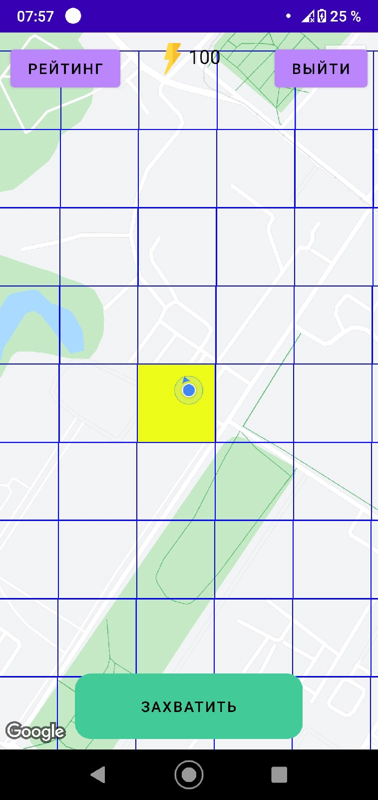

# GeoInvaders

Данное приложение было создано как игровое. Цель данной игры состоит в том, чтобы соревноваться с другими игроками, захватывая новые территории.

Список используемых технологий:
<ol>
  <li>Goggle Maps</li>
  <li>Retrofit 2</li>
  <li>Node js</li>
  <li>Mongo DB</li>
  <li>Хостинг Heroku</li>
  <li>Хостинг Clever Cloud</li>
</ol>

При запуске приложения появляется стартовое окно. Кнопки “Войти” и “Информация” ведут на соответствующие окна.
 

 
При переходе на окно входа пользователю предлагается ввести nickname и пароль или создать новый аккаунт.
 

 
При создании нового аккаунта также необходимо ввести nickname и пароль.
 

 
После входа открывается карта. Она разделена на квадраты одинакового размера. Справа вверху находится кнопка “Выйти”, которая позволяет выйти из аккаунта и открыть стартовое окно. Посередине вверху находится число, не превышающее 100, оно показывает сколько очков энергии осталось у пользователя, при захвате региона отнимается 20 единиц энергии.
 

 
Слева сверху находится кнопка “Рейтинг”. При нажатии открывается окно со списком пользователей и количеством областей, которые они захватили. Текущий пользователь подсвечивается ярко-зелёным цветом. По кнопке “Назад” можно вернуться на карту.
 

 
Внизу карты расположена кнопка “Захватить”. При нажатии открывается экран с таймером на 20 секунд. По истечении времени регион считается захваченным, и он окрашивается в полупрозрачный цвет. При перемещении пользователя можно захватывать и другие регионы таким образом расширяя свои владения и поднимаясь в рейтинге.
 

 

<a href="https://drive.google.com/file/d/1vzJ5BJQZY03u2xW_tovBBgeTizrd-IVj/view?usp=sharing">Пример работы приложения</a>

В дальнейшем планируется:
<ol>
  <li>Внедрить систему бонусов</li>
  <li>Сделать возможность объединяться в группы по несколько человек</li>
  <li>Оптимизировать расчёт координат полей для быстрой отрисовки полей</li>
</ol>

<a href="https://drive.google.com/file/d/1ugn5ert1jiH2exz53MRf1nIqoXCM5Cc2/view?usp=sharing">APK приложения</a>
